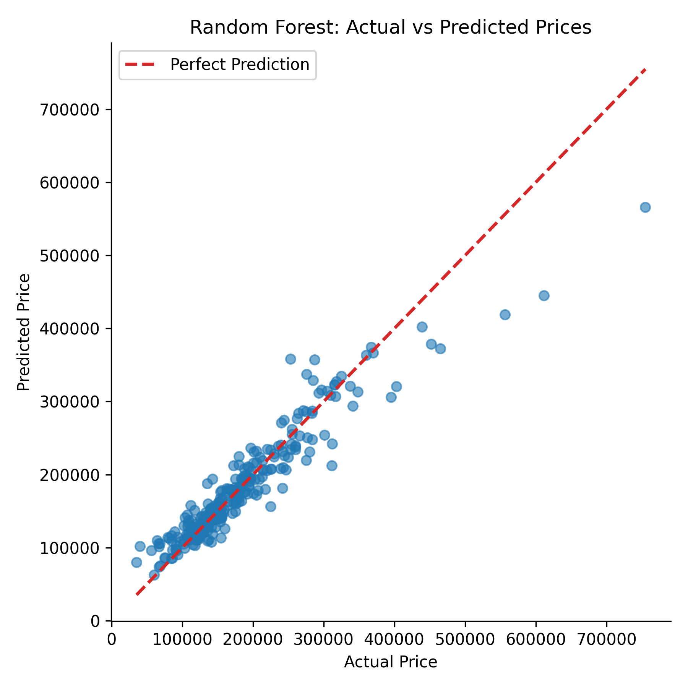
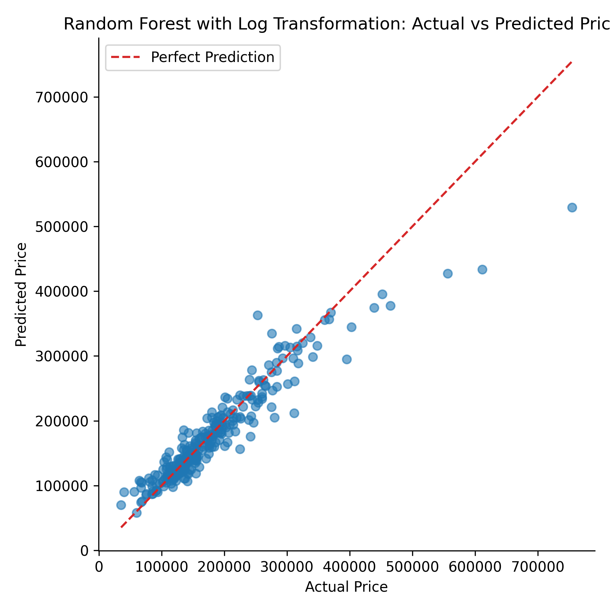
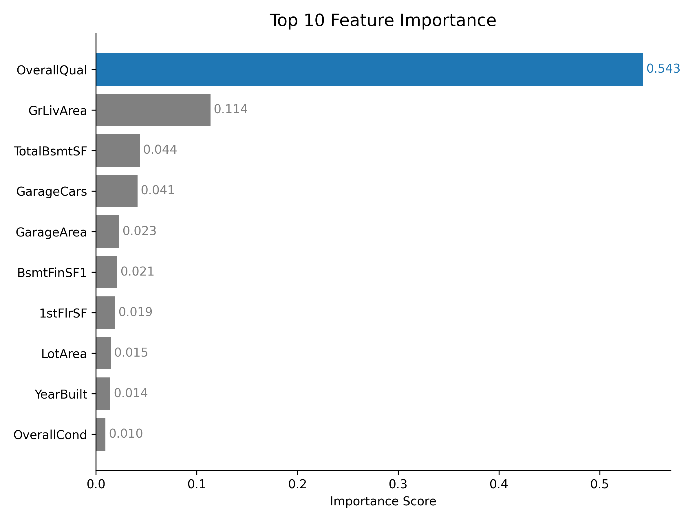

# 🏠 Housing Price Prediction (Kaggle Project)

## 📌 Overview

This project builds and evaluates machine learning models to predict housing prices using a real-world dataset from Kaggle. It demonstrates a complete data science workflow, including data cleaning, feature engineering, model development, evaluation, and interpretation.

A key focus of this project is understanding model behavior, identifying prediction bias, and testing improvement strategies such as log transformation.

---

## 📊 Dataset

* Source: Kaggle – *House Prices: Advanced Regression Techniques*
* Size: ~1,400 samples with 80+ features
* Includes both numerical and categorical variables with missing values

---

## 🔧 Data Processing

* Handled missing values:

  * Numerical features → imputed with mean
  * Categorical features → filled with `"None"`
* Applied one-hot encoding for categorical variables
* Final feature space expanded to ~300 features

---

## 🤖 Modeling

### 🔹 Baseline Model: Linear Regression

* Simple and interpretable
* Test R²: **0.44**

### 🔹 Random Forest (No Transformation)

* Captures non-linear relationships
* Test R²: **0.89**

---

## 📈 Model Evaluation

### 🔍 Key Observation

From the prediction scatter plot:

* Lower-priced houses are predicted relatively accurately
* Higher-priced houses tend to be **systematically underestimated**

👉 This indicates model bias and difficulty in learning rare high-value properties.

---

### 📊 Actual vs Predicted (Before Log)



👉 High-priced houses are consistently below the reference line, showing underestimation.

---

## 🔁 Model Improvement: Log Transformation

To address skewness in housing prices, log transformation was applied:

* Test R² after log: **0.88**

👉 Result:

* No significant improvement in single test performance
* High-price underestimation still persists

---

### 📊 Actual vs Predicted (After Log)



👉 Log transformation improves distribution balance slightly but does not eliminate underestimation of high-priced houses.

---

## 🔬 Cross Validation (Model Comparison)

| Model                  | CV R² |
| ---------------------- | ----- |
| Random Forest (no log) | ~0.86 |
| Random Forest (log)    | ~0.87 |

### 🎯 Key Insight

* Log transformation improves **cross-validation performance**
* Indicates better **model stability and generalization**
* Highlights the importance of evaluating models beyond a single test split

---

## 📊 Feature Importance



👉 The most important features include:

* OverallQual
* GrLivArea
* TotalBsmtSF
* GarageArea

These align with real-world housing valuation factors.

---

## 🛠️ Tools & Technologies

* Python (Pandas, NumPy, Scikit-learn)
* Matplotlib
* Jupyter Notebook

---

## 🚀 Key Takeaways

* Random Forest significantly outperforms Linear Regression
* The model tends to underestimate high-priced houses
* Log transformation improves model stability but not test accuracy
* Cross-validation provides a more reliable evaluation metric
* Feature importance aligns with domain knowledge

---

## 📁 Project Structure

```text id="proj_struct_v7"
housing-price-project/
│
├── data/
│   └── train.csv
│
├── notebooks/
│   └── real_estate_project.ipynb
│
├── outputs/
│   └── figures/
│       ├── actual_vs_predicted.png
│       ├── actual_vs_predicted_log.png
│       └── top_10_feature_importance.png
│
├── README.md
└── requirements.txt
```

---

## 📎 Quick Access

👉 [View Notebook](./notebooks/real_estate_project.ipynb)

---

## 📬 Contact

Feel free to connect or reach out for discussion or collaboration.
